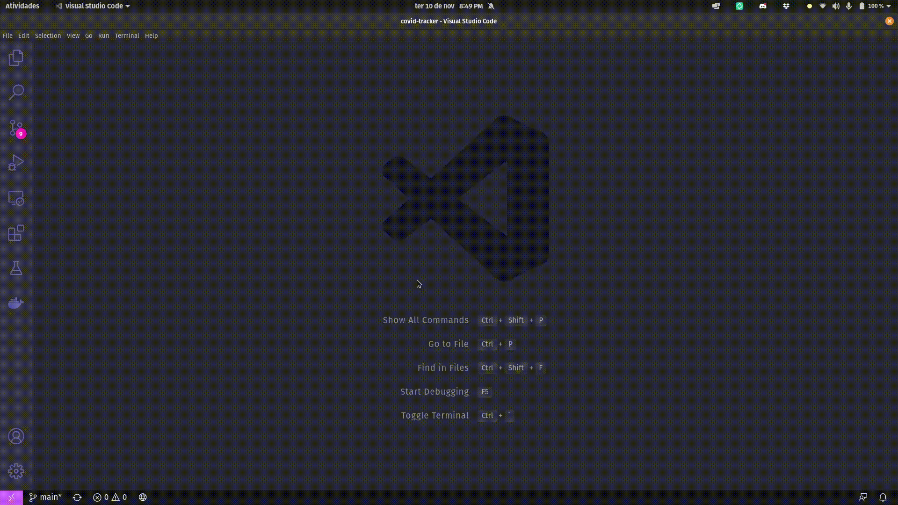
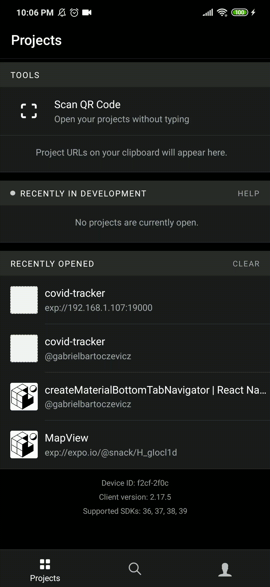
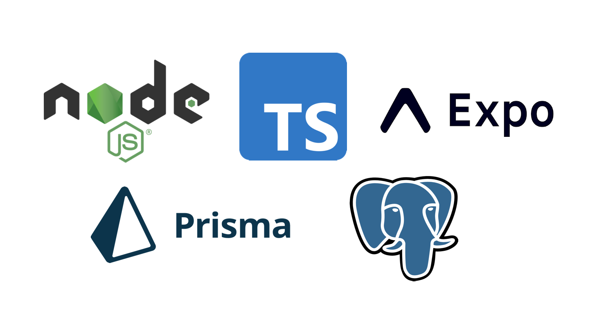

<h3 align="center">Covid Tracker - Em construção 🚧</h3>

- [Sobre](#sobre)
- [Módulos do Projeto (Instalação)](#módulos-do-projeto-instalação)
  - [Aplicativo](#aplicativo)
  - [Collector](#collector)
  - [Serve](#serve)
- [Tecnologias](#tecnologias)
- [Roadmap](#roadmap)
- [Licença](#licença)

## Sobre

O aplicativo vai colher dados da Covid 19 pelo Brasil e apresentá-los via aplicativo mobile. Coletamos os dados do estado do Paraná até a data 04/11/2020. Os dados foram coletados do CSV do site [Painel Coronavírus](https://covid.saude.gov.br).

Este projeto está sendo desenvolvido na Faculdades da Indústria de Londrina.

## Módulos do Projeto (Instalação)

O projeto é separado em 3 módulos, sendo eles 2 responsáveis pela coleta e disponibilidade dos dados e o terceiro um aplicativo mobile.
São necessários, anteriormente, as ferramentas NodeJS, Yarn, Docker & Docker Compose. Rode `yarn` na root do projeto para instalar as dependências dos pacotes do Workspace. Rode o Docker com `docker-compose up` para iniciar o banco de dados Postgres.

### Aplicativo

Para rodar o aplicativo em desenvolvimento basta rodar os comandos à seguir:

```bash
cd packages/clients/mobile
yarn start
```

Para executá-lo em seu celular você precisa instalar a plaforma Expo ([Android](https://play.google.com/store/apps/details?id=host.exp.exponent&referrer=www) e [IOS](https://apps.apple.com/app/apple-store/id982107779)) e ler o QR Code que aparecerá na sua tela (Terminal e Navegador).
Ele deverá estar conectado na mesma rede do que a aplicação Serve para conectar durante o desenvolvimento.



<p align="center"></p>

<p align="center"><small>Prévia do aplicativo (Atualizar com gif recente)</small></p>

### Collector

Esta parte da aplicação é responsável pela leitura e armazenamento no banco de dados PostgreSQL. 

O CSV deve seguir a nomeação do arquivo baixado do site [Painel Coronavírus](https://covid.saude.gov.br): HIST_PAINEL_COVIDBR_07nov2020, onde o dia terá que ser o dia anterior do atual.

Para inicializar a aplicação em modo desenvolvimento é só utilizar os comando à seguir:

```bash
cd packages/server/collector
yarn dev
```

### Serve

É a API responsável que disponibiliza os dados em JSON para aplicação mobile consultar via POST (Usando filtros).

Para inicializar a aplicação em modo desenvolvimento é só utilizar os comando à seguir:

```bash
cd packages/server/collector
yarn dev
```

O body à seguir é o filtro usado para consulta POST no endpoint `/notifications`.

```json
{
	"state_name": null,
	"city_name": "Londrina",
	"interval": {
		"start": "2020-11-03T22:21:34.422Z",
		"end": "2020-11-09T22:21:34.422Z"
	}
}
```

A response está no seguinte formato

```json
{
  "meta": {
    "total_notifications": 23,
    "total_deaths": 0,
    "total_recovered": 0
  },
  "notifications": [
    {
      "date": "2020-11-04T00:00:00+00:00",
      "notifications": 21,
      "deaths": 0,
      "recovered": 0
    },
    {
      "date": "2020-11-03T00:00:00+00:00",
      "notifications": 2,
      "deaths": 0,
      "recovered": 0
    }
  ]
}
```

## Tecnologias

<h1 align="center">
  
</h1>

## Roadmap

Entregar num futuro próximo

- Refatorar o uso de Date no front e no back
- Refatorar gráfico
- Usar Sonic para a busca de municípios (Opcional)
- Replicar banco Postgres para as duas aplicações backend
- Melhorar design do frontend
- Automatizar a coleta do CSV usando cron e web scraping
- Leitura completa do arquivo CSV (Todos os estados do Brasil)

## Licença

Este projeto esta sob a licença MIT.

***

Feito com 💜 por Gabriel Bartoczevicz [Entre em contato!](https://www.linkedin.com/in/gabriel-bartoczevicz-7360901a6/)
